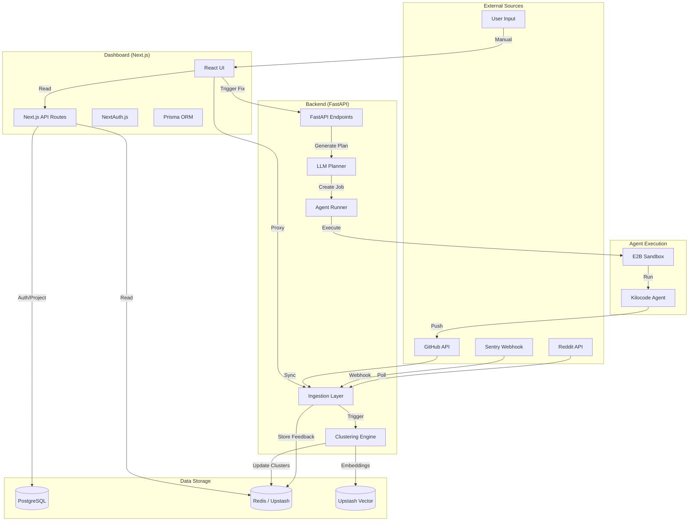

# Soulcaster Architecture Design

## 1. Overview

Soulcaster is a platform that ingests user feedback from multiple sources (Reddit, Sentry, GitHub, manual input), clusters similar issues using embeddings, generates coding plans using LLMs, and executes fixes via autonomous coding agents.

The system is composed of two primary services:
1.  **Backend (FastAPI)**: Handles ingestion, clustering, planning, and agent orchestration.
2.  **Dashboard (Next.js)**: Provides the user interface for viewing clusters, managing projects, and triggering fixes.

## 2. High-Level Architecture Diagram

## 3. Core Components

### 3.1 Backend (FastAPI)
*   **Location**: `backend/`
*   **Key Responsibilities**:
    *   **Ingestion**: Normalizes data from Reddit, Sentry, etc., into `FeedbackItem` objects.
    *   **Clustering**: Groups feedback using embeddings (Gemini) and clustering algorithms (Agglomerative, Centroid, or Vector-based).
    *   **Planning**: Generates `CodingPlan`s from clusters using LLMs (Gemini).
    *   **Agent Orchestration**: Manages `AgentJob`s and dispatches them to the configured runner (e.g., E2B sandbox).
*   **Key Files**:
    *   `main.py`: API entry point and endpoints.
    *   `store.py`: Abstraction over Redis (and in-memory fallback) for feedback, clusters, and jobs.
    *   `clustering.py`: Core clustering logic (pure functions).
    *   `agent_runner/sandbox.py`: Implementation of the E2B-based coding agent runner.

### 3.2 Dashboard (Next.js)
*   **Location**: `dashboard/`
*   **Key Responsibilities**:
    *   **User Interface**: Displays clusters, feedback details, and job status.
    *   **Authentication**: GitHub OAuth via NextAuth.js.
    *   **Project Management**: Creates and manages projects via Prisma/Postgres.
    *   **Proxy**: Proxies requests to the backend for data not stored in Postgres (e.g., feedback, clusters).
*   **Key Files**:
    *   `app/(dashboard)/dashboard/clusters/page.tsx`: Main cluster list view.
    *   `lib/clustering.ts`: Client-side clustering utilities (legacy/shared logic).
    *   `lib/vector.ts`: Upstash Vector interaction (potentially duplicating backend logic).
    *   `prisma/schema.prisma`: Schema for Users, Projects, Accounts (NextAuth).

### 3.3 Storage Layer
*   **PostgreSQL**: Stores relational data: Users, Projects, Auth Accounts. Managed via Prisma in the Dashboard.
*   **Redis (Upstash)**: Stores high-volume/ephemeral data: Feedback Items, Clusters, Job Logs, Integration Configs. Accessed by both Backend and Dashboard (Dashboard often reads directly or via Backend proxy).
*   **Upstash Vector**: Stores embeddings for vector-based clustering and retrieval.

### 3.4 Agent Execution
*   **Environment**: E2B Sandbox (Secure, isolated micro-VMs).
*   **Agent**: `Kilocode` (CLI tool running inside the sandbox).
*   **Flow**:
    1.  Backend creates a `CodingPlan`.
    2.  Backend starts an E2B sandbox.
    3.  Backend injects the plan and a python script (`AGENT_SCRIPT`).
    4.  Script clones the repo, creates a branch/PR, and runs `kilocode --auto` with the plan.
    5.  Results/Logs are streamed back to Redis.

## 4. Key Decision Points & Technical Debt

### 4.1 Data Access Patterns (Dual Access)
*   **Current State**: Both the Backend (Python) and Dashboard (Node/TS) access Redis and Vector DB independently. The Backend uses `backend/store.py`, while the Dashboard uses `dashboard/lib/redis.ts` (implied) and `dashboard/lib/vector.ts`.
*   **Risk**: Logic duplication (e.g., key generation patterns, clustering thresholds) can lead to inconsistencies.
*   **Decision Point**: Should the Dashboard treat the Backend as the *only* source of truth for feedback/cluster data, or continue direct DB access for performance?
    *   *Recommendation*: Move towards a "Backend-as-API" model where the Dashboard reads via Backend endpoints, reducing duplication.

### 4.2 Clustering Logic Location
*   **Current State**: Clustering logic exists in both `backend/clustering.py` and `dashboard/lib/clustering.ts` / `dashboard/lib/vector.ts`. The backend runs the primary "ingest-time" clustering, but the dashboard has code for vector operations.
*   **Decision Point**: Consolidate all clustering logic into the Backend service to ensure a single definition of "Cluster".

### 4.3 Agent Runner Abstraction
*   **Current State**: `backend/agent_runner/sandbox.py` is tightly coupled to E2B and specific environment variables (`KILOCODE_TEMPLATE_ID`).
*   **Decision Point**: Formalize the `AgentRunner` interface to easily swap between E2B, local execution (for dev), or other providers (AWS Fargate legacy code exists).

### 4.4 Authentication & Authorization
*   **Current State**: Dashboard handles AuthN (GitHub OAuth). Backend endpoints often take a `project_id` query param without strict token validation in some paths (relying on internal network security or shared secrets in headers).
*   **Decision Point**: Strengthen Backend security. The Dashboard should pass a signed token or verify ownership before proxying requests to the Backend.

## 5. Decision Log

| ID | Date | Topic | Decision | Status |
|---|---|---|---|---|
| D-001 | 2025-12-19 | Architecture Doc | Created initial architecture documentation. | Done |
| | | | | |

## 6. Code Path References

*   **Ingestion Entry**: `backend/main.py` -> `ingest_*` endpoints.
*   **Clustering Core**: `backend/clustering.py`.
*   **Vector Logic**: `dashboard/lib/vector.ts` (Dashboard) vs `backend/clustering.py` (Backend).
*   **Agent Execution**: `backend/agent_runner/sandbox.py` -> `SandboxKilocodeRunner`.
*   **Data Models**:
    *   Backend: `backend/models.py` (Pydantic)
    *   Dashboard: `dashboard/prisma/schema.prisma` (Prisma) + `dashboard/types/index.ts`